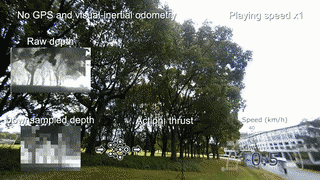

# Vision-based Agile Flight Training Code

## Overview

This repository contains the training code from **Learning Vision-based Agile Flight via Differentiable Physics**. Accepted by [**Nature Machine Intelligence'25**](https://www.nature.com/articles/s42256-025-01048-0). A very similar paper about this project written by the exact same authors can be found [here](https://arxiv.org/pdf/2407.10648).

This is a fork of [project webpage](https://henryhuyu.github.io/DiffPhysDrone_Web/). Master branch contains the original code and updated branch contains any changes.

## Quick Demos
### Single Agent Flights
<table>
  <tr>
    <td></td>
    <td></td>
  </tr>
</table>

### Swarm Tasks
<table>
  <tr>
    <td></td>
    <td></td>
  </tr>
</table>


## Environment Setup
### Python Environment

The code has been used with the following environment:

- **PyTorch**: 2.8.0 for Linux and CUDA 12.8
- **Python**: 3.11.13
- **CUDA**: 12.8 (with Nvidia RTX 5080 GPU)

The code should be compatible with other PyTorch and CUDA versions.

I recommend installing [miniconda](https://www.anaconda.com/docs/getting-started/miniconda/install#linux-terminal-installer) using the Linux terminal and creating a conda environment using this. You can follow these steps:
```bash
# Create and activate conda environment
conda create --name drone python=3.11
conda activate drone

# Install dependencies
pip install torch==2.8.0 torchvision==0.23.0
# OpenCV cannot be upgraded beyond this version because NumPy cannot be upgraded to 2.0 or greater (there is a dependency conflict).
pip install opencv-python==4.10.0.82 numpy==1.26.4
pip install tqdm tensorboard
```

### Build CUDA Ops

To build the CUDA operations, run the following command:

```bash
pip install -e src
```

## Training

To start the training process, use the following command:

```bash
# For multi-agent
python main_cuda.py $(cat configs/multi_agent.args)
# For single-agent
python main_cuda.py $(cat configs/single_agent.args)
```

multi_agent.args is unchanged from the original repo. single_agent.args includes all of the arguments from the original repo as well as a few extra ones, namely `--use_depth_ratio` to change the input from absolute depth to log(depth at t / depth at t-1) and `--ckpt_dir` to specify where to store model checkpoints (which occur by default every 10k iterations).

The training script will create a tensorboard folder under the folder `runs/`. I recommend moving the folder containing the model files into the respective tensorboard folder afterwards to keep them together.

## Models
Not much work or experimentation has been done with trying different models. Currently there are two models available: the original model in `model.py` and a larger model based on a modified Xception architecture in `xception_model.py`. The training script and validation code import the original model from `model.py` by default; to change this you can edit the code.

## Evaluation
You need to download the simulation validation code from the [GitHub release page](https://github.com/az40/DiffPhysDrone/releases).

To evaluate the trained model in multi-agent settings, use the following command to launch the simulator (note this is only for multi-agent swarms):
```bash
cd <path to multi agent code supplementary>
./LinuxNoEditor/Blocks.sh -ResX=896 -ResY=504 -windowed -WinX=512 -WinY=304 -settings=$PWD/settings.json
```

Then, run the following command to evaluate the trained model:
```bash
python eval.py --resume <path to checkpoint> --target_speed 2.5
```

For evaluation/testing of the single-agent settings and models, see the `validation_code/high_speed_flight/` readme after downloading it from the [GitHub release page](https://github.com/az40/DiffPhysDrone/releases). Put the folder in this directory so that the relative path to it is `DiffPhysDrone/validation_code/`

## Citation
If using this repository, please cite our work
```
@article{zhang2025learning,
  title={Learning vision-based agile flight via differentiable physics},
  author={Zhang, Yuang and Hu, Yu and Song, Yunlong and Zou, Danping and Lin, Weiyao},
  journal={Nature Machine Intelligence},
  pages={1--13},
  year={2025},
  publisher={Nature Publishing Group}
}
```
